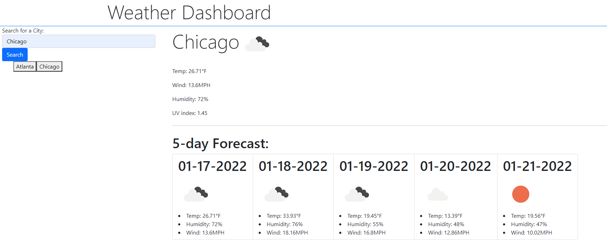

  # **Weather Dashboard**

   

  ### Table of Contents
  **[Discription](#discription)** 
  **[Usage](#usage)** 
  **[License](#license)** 
  **[Contributing](#contributing)** 
  **[Tests](#tests)** 
  **[Questions](#questions)** 
  **[Example](#example)** 
  

  ## Discription 

    AS A traveler
    I WANT to see the weather outlook for multiple cities
    SO THAT I can plan a trip accordingly

  

  ## Installation
  no npm packages to install

  ## Usage

    GIVEN a weather dashboard with form inputs
    WHEN I search for a city
    THEN I am presented with current and future conditions for that city and that city is added to the search history
    WHEN I view current weather conditions for that city
    THEN I am presented with the city name, the date, an icon representation of weather conditions, the temperature, the humidity, the wind speed, and the UV index
    WHEN I view the UV index
    THEN I am presented with a color that indicates whether the conditions are favorable, moderate, or severe
    WHEN I view future weather conditions for that city
    THEN I am presented with a 5-day forecast that displays the date, an icon representation of weather conditions, the temperature, the wind speed, and the humidity
    WHEN I click on a city in the search history
    THEN I am again presented with current and future conditions for that city

  ## Contributing

  Fernando Davila

  ## Questions
  github: nandodavila
  email: nandodavila94@gmail.com

  ## Example
  https://nandodavila.github.io/Weather-Dashboard/

  

  

https://nandodavila.github.io/Weather-Dashboard/